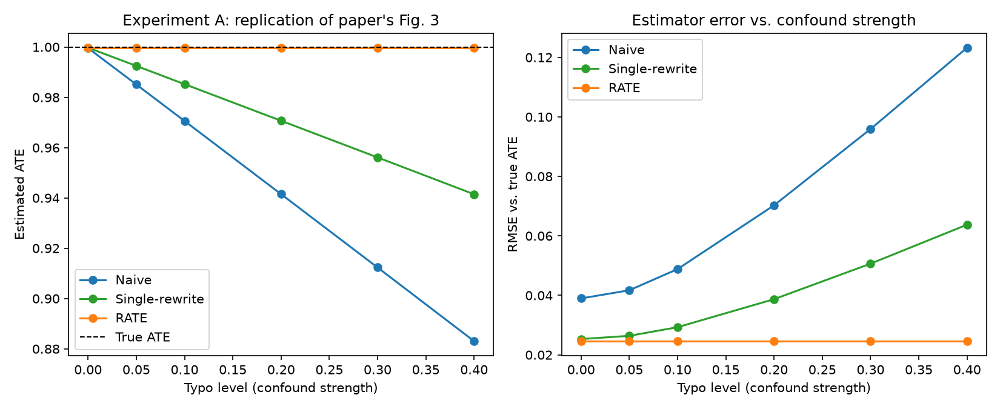
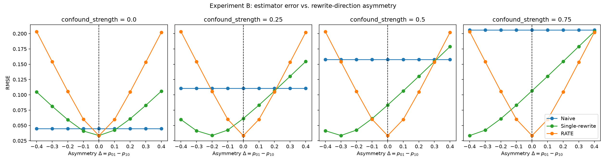

# RATE Stress Test

> **Empirical Evaluation of the Assumptions Behind RATE: Causal Explainability of Reward Models with Imperfect Counterfactuals**

[]()
[-green)](https://arxiv.org/abs/2410.11348)

---

## Overview

This repository contains the empirical study for our final project in **Causal Inference in the AI Era**.

We investigate the robustness of **RATE (Rewrite-based Attribute Treatment Estimator)**, a causal framework for measuring how textual attributes causally affect reward-model scores.

The project includes a qualitative replication of the paper's confounding experiment and a novel stress test of its direction-independent rewrite-error assumption.

---

## Paper

**Title:** RATE: Causal Explainability of Reward Models with Imperfect Counterfactuals

**Authors:** David Reber, Sean M. Richardson, Todd Nief, Cristina Garbacea, and Victor Veitch

**Venue:** ICML 2025, PMLR 267

**Paper:** https://arxiv.org/abs/2410.11348

**Original code:** https://github.com/toddnief/RATE

---

## Research Question

RATE uses a double-rewrite procedure:

```text
Original → Rewrite → Rewrite of Rewrite
```

Its validity theorem assumes that off-target rewrite errors follow a distribution that does not depend on rewrite direction.

Our central question is:

> How does RATE behave when this direction-independence assumption is violated, and is this failure mode distinct from the confounding problem RATE was designed to solve?

---

## Key Assumptions

### Assumption 1 — Direction-Independent Rewrite Errors

Off-target changes introduced during rewriting should follow the same distribution in both rewrite directions.

### Assumption 2 — Additive Reward Components

The reward contribution of the target and immutable attributes should be separable from the contribution of rewrite-induced changes.

Our experiments directly test **Assumption 1** while satisfying Assumption 2 by construction through an additive synthetic reward function.

---

## Experimental Design

Both experiments use a known ground-truth ATE, allowing us to calculate bias, variance, and RMSE exactly.

### Experiment A — Qualitative Replication and Sanity Check

We use 3,000 IMDB reviews: 1,500 beginning with a vowel and 1,500 not. Typos are introduced only into the vowel-starting group at six levels:

```text
0.00, 0.05, 0.10, 0.20, 0.30, 0.40
```

The rewrite and round-trip rewrite are simulated as direction-symmetric. This experiment verifies the expected qualitative behavior: as confounding increases, the naive and single-rewrite estimators become more biased while RATE remains stable.

### Experiment B — Direction-Asymmetry Stress Test

We use a fully synthetic simulation with two independently controlled parameters:

- `confound_strength`: association between the original off-target typo flag and treatment \(W\).
- `Δ = p01 − p10`: difference between off-target error probabilities in the two rewrite directions.

The average rewrite-error rate is held fixed while `Δ` changes. This separates sensitivity to observational confounding from sensitivity to rewrite-direction asymmetry.

For each setting, we compare:

| Estimator | Description |
|---|---|
| Naive | Difference between observed treatment groups |
| Single Rewrite | Comparison between each original and its rewrite |
| RATE | Comparison between the rewrite and rewrite-of-the-rewrite |

---

## Hypotheses

### H1 — Increasing Confounding

As confounding becomes stronger:

- The naive estimator becomes increasingly biased.
- RATE remains stable when rewrite symmetry holds.

### H2 — Breaking Direction Symmetry

As rewrite errors become more direction-dependent:

- RATE's bias increases.
- This effect occurs independently of confounding strength.

---

## Repository Structure

```text
RATE_StressTest/
│
├── Synthetic_Data/
│   ├── RATE_Dataset_Generation.ipynb
│   ├── datasets_by_typo_level/
│   └── synthetic_text_data_summary.csv
│
├── notebooks/
│   └── rate_stress_test.ipynb
│
├── src/
│   ├── reward.py
│   ├── simulation.py
│   ├── estimators.py
│   ├── metrics.py
│   └── plotting.py
│
├── results/
│   ├── figures/
│   │   ├── experiment_a_replication.png
│   │   ├── experiment_b_headline.png
│   │   └── potential_outcomes_diagram.png
│   └── tables/
│       ├── experiment_a_results.csv
│       └── experiment_b_results.csv
│
├── report/
│   ├── report.md
│   ├── report.pdf
│   ├── build_diagram.py
│   └── build_pdf.py
│
├── requirements.txt
├── requirements-report.txt
└── README.md
```

---

## Setup

The project requires Python 3.11 or later.

```bash
python -m venv .venv
source .venv/bin/activate
pip install -r requirements.txt
python -m ipykernel install --user \
  --name rate_stresstest \
  --display-name "RATE StressTest"
```

On Windows, activate the environment with:

```text
.venv\Scripts\activate
```

---

## Running the Experiments

Open `notebooks/rate_stress_test.ipynb`, select the **RATE StressTest** kernel, and run all cells.

The notebook will:

1. Verify the three estimators using a small toy example.
2. Run Experiment A and save its result table and figure.
3. Run Experiment B and save its result table and figure.

---

## Evaluation Metrics

For every experimental setting, estimates are aggregated across multiple random seeds. We report:

- Mean ATE estimate
- Bias against the true ATE
- Variance
- Root Mean Squared Error (RMSE)

Experiment A uses 200 random seeds. Experiment B uses 300 random seeds and 2,000 simulated units per seed.

---

## Results

### Experiment A

The naive and single-rewrite estimators become increasingly biased as typo confounding grows, whereas RATE remains stable near the true ATE.



### Experiment B

RATE is unaffected by confounding strength but becomes increasingly biased as rewrite-direction asymmetry grows. Its bias changes approximately linearly with \(\Delta\), matching the theoretical prediction from the synthetic reward function.

The naive estimator shows the opposite behavior: it is sensitive to confounding but unaffected by rewrite asymmetry. The single-rewrite estimator is sensitive to both.



| Estimator | Sensitive to confounding? | Sensitive to direction asymmetry? |
|---|---:|---:|
| Naive | Yes | No |
| Single Rewrite | Yes | Yes |
| RATE | No | Yes |

---

## Main Conclusion

RATE successfully addresses confounding in the observed data when its assumptions hold. However, it is sensitive to direction-dependent rewrite errors. This represents a distinct failure mode from observational confounding and shows that RATE's reliability depends on the behavior of the selected LLM rewriter and rewrite instruction.

Our simulation quantifies RATE's sensitivity to this violation. It does not claim that any particular level of asymmetry occurs in GPT-4o or another real rewriter.

---

## Report

The written report is available at [`report/FinalProjectReport.pdf`](report/FinalProjectReport.pdf).

To rebuild the report and its causal diagram:

```bash
pip install -r requirements-report.txt
python report/build_diagram.py
python report/build_pdf.py
```

---

## Authors

**Tuvia Hausdorff**

**Yuval Ratzabi**  

Final Project — *Causal Inference in the AI Era*
