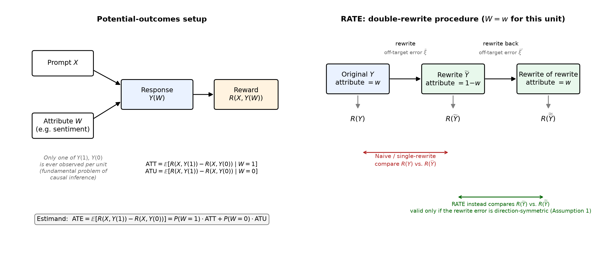

# Critical Evaluation and Empirical Stress Test of a Causal Inference Paper

**Course:** Causal Inference in the AI Era (361-2-2420)

**Student 1:** Tuvia Hausdorff — ID: 322068834 — Email: thausdorff@gmail.com

**Student 2:** Yuval Ratzabi — ID: [TODO] — Email: yuvalratzabi@gmail.com

**Paper title:** RATE: Causal Explainability of Reward Models with Imperfect Counterfactuals

**Authors:** David Reber, Sean M. Richardson, Todd Nief, Cristina Garbacea, Victor Veitch

**Venue:** ICML 2025, PMLR 267

**Paper link:** https://arxiv.org/abs/2410.13844

**Code link:** https://github.com/toddnief/RATE

---

## 1. Summary of the Paper

Reward models (RMs) are used throughout the LLM alignment pipeline — for RLHF, for best-of-n sampling, for evaluation — but they are opaque. Given a prompt and a response, an RM outputs a scalar, and it's usually not clear what property of the response is actually driving that number. The paper asks a specific version of this question: if we pick some high-level attribute of a response (sentiment, helpfulness, length, complexity), how much does the reward model actually respond to *that attribute*, as opposed to whatever else happens to be correlated with it in the data the RM was evaluated on?

The obvious way to answer this is to take a labeled dataset, split it by whether the attribute is present, and compare the average reward across the two groups. The paper calls this the naive estimator and shows it is generally wrong, for a reason that should be familiar from any causal inference class: it's a difference in group means on observational data, and it will pick up whatever else is correlated with the attribute in that particular dataset. Their example is a good one — if negative-sentiment reviews in your evaluation set happen to have more typos than positive ones, the naive estimator will report that the RM "cares about sentiment" when some or all of that signal is really the RM reacting to typos.

Their proposed fix is RATE (Rewrite-based Attribute Treatment Estimator). Instead of comparing existing responses with and without the attribute, they use an LLM to rewrite each response to flip the attribute, producing an approximate counterfactual pair. If those rewrites were perfect — changing only the target attribute and nothing else — this would directly solve the problem: reward differences between original and rewrite would isolate the effect of the attribute. The catch, which the paper is upfront about, is that LLM rewrites are not perfect. Asking GPT-4o to "make this review negative" will usually also change other things about the text — tone, length, occasionally grammar — and if those off-target changes are systematic, they will bias the estimate in the same way the naive estimator was biased, just one level removed.

RATE's contribution is a way to correct for this without having to enumerate what the off-target changes actually are. The idea is to rewrite twice: take the original response, rewrite it to flip the attribute, then rewrite that rewrite back to the original attribute value. Instead of comparing the original to the first rewrite, RATE compares the first rewrite to the second (the "rewrite of the rewrite"). The intuition is that whatever off-target noise the LLM introduces on the way there, it introduces again — in expectation the same way — on the way back, so differencing these two rewritten versions instead of the original and the rewrite should cancel that noise out.

## 2. Causal Setup

The estimand is an average treatment effect. Let `W ∈ {0,1}` be the binary attribute of interest (e.g., sentiment), `X` the prompt, `Y` the response, and `R(X,Y)` the reward model's score. Following the potential outcomes framework, `Y(1)` and `Y(0)` are the versions of a response that would exist under each value of `W`, holding everything else about the response fixed. The estimand is

```
ATE = E[R(X, Y(1)) - R(X, Y(0))]
```

i.e. how much the reward changes, on average, if we could intervene on `W` alone. They also define the ATT and ATU (effect on the treated/untreated subpopulations), which matter because RATE estimates ATT and ATU separately and then combines them, rather than estimating ATE directly.

The fundamental problem of causal inference applies here in the usual way: for any given response we only observe `Y(W)` for the `W` it actually has, never the counterfactual. The paper's move is to use an LLM as a stand-in for the missing potential outcome — `Re(Y, w)` denotes the rewrite operation that takes a response and a target attribute value and returns an approximate `Y(w)`. This is the same idea as using an outcome model to impute a missing potential outcome, except the "model" here is a general-purpose LLM given a natural language instruction rather than something fit to the data.



*Figure 1: Left — the potential-outcomes setup: a prompt `X` and attribute `W` jointly determine a response `Y(W)`, whose reward `R(X,Y(W))` is only ever observed at the realized value of `W`. Right — RATE's double-rewrite procedure for a single unit. Naive and single-rewrite estimators compare the original response to a single rewrite; RATE instead compares the rewrite to a second, "round-trip" rewrite, which is only valid if the off-target error introduced by rewriting doesn't depend on which direction the rewrite went (Assumption 1) — the assumption this report stress-tests.*

One thing worth flagging, because it's easy to miss on a first read: the treatment here is defined at the level of a high-level, and often subjective, text attribute rather than something like a dosage or a binary indicator recorded in a dataset. What counts as "helpful" is itself somewhat underspecified, and the authors acknowledge this — the rewrite instruction is doing double duty as both the intervention and the operational definition of the attribute. Two different rewrite instructions for "helpfulness" can produce two different interventions, and there's no ground truth to check them against beyond eyeballing the outputs. This isn't a flaw exactly, but it does mean the estimand is less crisp than it might first appear.

## 3. Key Assumptions

RATE's identification result (their Theorem 4.1) needs two structural assumptions, on top of the usual requirement that the reward function is bounded and the data are i.i.d.

**Assumption 1 (direction-independent rewrite errors).** They decompose a response's attributes into the target attribute `W`, off-target attributes `Z` that a rewrite never touches, and off-target attributes `ξ` that a rewrite *might* touch (its "errors"). Assumption 1 says the distribution these errors are drawn from doesn't depend on which direction the rewrite is going — rewriting 0→1 and rewriting 1→0 introduce the same kind and amount of off-target noise, in distribution. Their working example is typo correction: they claim GPT-4o fixes typos "nearly always, independent of the attribute being rewritten," so whichever direction you rewrite in, typos get cleaned up at roughly the same rate.

**Assumption 2 (additive reward).** The reward has to decompose as `R = R_{W,Z}(X,W,Z) + R_ξ(X,ξ)` — the part of the reward that depends on the target and immutable off-target attributes has to be separable from the part that depends on the rewrite-induced noise, with no interaction term between them.

Given these two, they show RATE is unbiased and consistent for ATT, ATU, and ATE. The proof is in their appendix and we didn't find an issue with it — conditional on the assumptions, the double-rewrite construction really does make the off-target error terms cancel in expectation. The paper is also careful to note that these are *sufficient*, not necessary, conditions, and that there's no a priori reason imperfect rewrites should support causal estimation at all — the theorem exists mainly to show the approach isn't vacuous.

What struck us reading this is that Assumption 1 is doing almost all the identifying work, and it's asserted based on one qualitative observation about one LLM's behavior on one off-target attribute (typos). It is not derived from any property of LLMs in general, and the paper doesn't offer a way to check it beyond looking at rewrite examples by hand. This is the assumption we chose to stress test.

## 4. Summary of the Paper's Results

The paper runs two kinds of experiments. The first are semi-synthetic experiments where the ground-truth ATE is known by construction, used to check that RATE actually recovers it. In one, they inject typos into IMDB reviews correlated with whether the review starts with a vowel, then measure the effect of "starts with a vowel" on a reward model — the true effect should be approximately zero, since a reward model has no reason to care about the first letter. The naive and single-rewrite estimators pick up a nonzero, and growing, effect as the typo/vowel correlation strengthens; RATE stays near zero throughout. In a second version, they treat a DistilBERT sentiment classifier as a stand-in reward model and induce a correlation between review length and sentiment, again finding that the naive estimator is sensitive to this correlation while RATE and the single-rewrite estimator are not.

The second set of experiments applies RATE to real reward models from RewardBench across several datasets and attributes (length, complexity, helpfulness, sentiment), without known ground truth. The headline finding here is that the naive and RATE estimates disagree substantially, in some cases by enough to change the qualitative conclusion — e.g. a reward model designed to correct for length bias (NCSOFT) looks meaningfully improved on length under the naive estimator, but RATE suggests the improvement is smaller than it looks and may partly reflect the model penalizing other attributes like complexity instead.

## 5. Our Critique

We think the identification argument in the paper is correct given its assumptions, and the semi-synthetic experiments do what they're supposed to — they show RATE isn't fooled by a confound that fools the naive estimator. What they don't show is whether RATE is fooled by a different, and in our view equally plausible, failure mode: a rewriter whose off-target error rate depends on which direction it's rewriting.

This matters because RATE doesn't remove the need for an untestable assumption, it moves it. The naive estimator needs unconfoundedness in the observed data; RATE instead needs the rewriter's own error-generating process to be direction-symmetric. That's not a property of the underlying population being measured, it's a property of a specific LLM's behavior on a specific attribute, and the paper's evidence for it is a single anecdote (GPT-4o and typos). We don't think it's obvious this generalizes. A plausible failure case: rewriting a response to be *more helpful* probably involves adding content (examples, caveats, structure), while rewriting to be *less helpful* probably involves removing it — the "error" in each direction (something like off-target length or specificity) has no obvious reason to be symmetric the way typo-correction is. The paper doesn't test this kind of case, and its own suggested diagnostic for rewrite quality — comparing the pooled reward distribution before and after a round-trip rewrite (their Figure 2) — checks a marginal quantity, not the `W`-conditional quantity RATE's estimator actually depends on, so it's not obvious it would catch an asymmetry that averages out across the two groups but not within each one.

To be clear about scope: we are not arguing RATE is wrong, or that Theorem 4.1 doesn't hold — it does, conditional on its assumptions. Our point is narrower: Assumption 1 is load-bearing, essentially untested in the paper, and (as our experiment below shows) its violation produces bias of a similar order of magnitude to the confounding problem RATE is designed to fix. A method whose validity rests on an assumption like this should probably come with some sense of how sensitive the estimate is if the assumption is off by some amount — the kind of sensitivity analysis that's become standard for unconfoundedness (E-values, Rosenbaum bounds) or parallel trends in diff-in-diff. RATE's paper doesn't include anything like that for Assumption 1.

## 6. Our Experiment

We ran two experiments, both using a fully synthetic reward function with a known ground-truth ATE, so that bias, variance, and RMSE can be computed exactly rather than estimated indirectly.

**Reward model.** We use `R = β_W · W + β_typo · has_typo + ε`, with `β_W = 1`, `β_typo = -0.5`, and `ε ~ N(0,1)`. This is additive by construction, so it satisfies Assumption 2 exactly — any bias we observe can be attributed to Assumption 1 alone, without Assumption 2 also being in play. The true ATE is `β_W = 1` for all three estimands (ATT = ATU = ATE, since the effect is homogeneous by construction — a simplification we come back to in the limitations).

**Experiment A (replication / sanity check).** Before trusting our estimator code on anything new, we reproduced the paper's own confounding-strength test using a dataset generated for this project: 3,000 IMDB reviews (1,500 starting with a vowel, 1,500 not), with typos injected into a fraction of the vowel-starting group's text at six severities (`typo_level ∈ {0.00, 0.05, 0.10, 0.20, 0.30, 0.40}`). We treat this typo-affected text as the confounded original observation (in the sense of the paper's own Table 2 setup) and simulate the rewrite and rewrite-of-rewrite steps as fully direction-symmetric — i.e. Assumption 1 holds by construction here, matching the paper's claim that GPT-4o always corrects typos regardless of direction. This makes Experiment A a check that our estimators reproduce known behavior, not a novel test.

**Experiment B (the stress test).** A fully synthetic simulation with no text at all, parameterized by two independent knobs. `confound_strength` controls how strongly a typo flag on the original observation correlates with `W` — this is the paper's own knob. `p01` and `p10` are the direction-specific probabilities that a rewrite carries a typo when rewriting 0→1 and 1→0 respectively; we define `Δ = p01 - p10` as the asymmetry, and sweep it while holding the average rate `(p01+p10)/2` fixed, so that `Δ` is the only thing changing. `confound_strength` and `Δ` are constructed to be orthogonal — the confound only ever appears in the original observation, and `Δ` only ever appears in the rewrite steps — so any effect of `Δ` on RATE's bias can't be attributed to confounding.

For both experiments, at each grid point we ran the naive, single-rewrite, and RATE estimators over many random seeds (200 for Experiment A, 300 for Experiment B, with 2,000 simulated units per seed in Experiment B) and computed bias, variance, and RMSE against the known true ATE.

## 7. Results

**Experiment A** reproduces the paper's Figure 3 pattern. As typo_level increases from 0.00 to 0.40, Naive's bias grows from about -0.0004 to -0.117 (RMSE 0.039 → 0.123) and Single-rewrite's bias grows from about -0.0003 to -0.059 (RMSE 0.025 → 0.064), while RATE's bias stays essentially flat at about -0.0004 (RMSE 0.025) across every level. This is what we expected going in — it's a check that our code is correct, not a new finding — and it gave us confidence to move on to Experiment B.


*Figure 2: Left — estimated ATE as confound strength (typo_level) increases; the dashed line is the true ATE. Right — RMSE against the true ATE for the same sweep. Naive and Single-rewrite degrade as confounding grows; RATE stays flat, reproducing the paper's own Figure 3.*

**Experiment B** is the main result. RATE's bias tracks `Δ` almost exactly linearly — a fitted slope of -0.4997 against a closed-form prediction of `β_typo = -0.5` — and this relationship is identical across every confound_strength level we tested (0.00, 0.25, 0.50, 0.75): the intercept and slope don't move at all when confounding changes. At `Δ = 0.4`, RATE's RMSE reaches about 0.202, worse than Naive's RMSE of about 0.045 at `Δ=0` and comparable to Naive's RMSE under the strongest confounding we tested (about 0.206 at confound_strength=0.75). Naive shows the opposite pattern: flat against `Δ`, but its bias grows to about -0.20 as confound_strength increases to 0.75. Single-rewrite is sensitive to both.


*Figure 3: RMSE against the true ATE as a function of the asymmetry Δ = p01 − p10, one panel per confound strength. RATE's error (orange) is a V-shape minimized exactly at Δ=0 and is identical across all four panels — it does not depend on confound strength at all. Naive (blue) shows the opposite pattern: flat across Δ, but shifted upward as confound strength increases. Single-rewrite (green) is sensitive to both.*

| Estimator | Sensitive to confound_strength? | Sensitive to Δ (asymmetry)? |
|---|---|---|
| Naive | Yes | No |
| Single-rewrite | Yes | Yes |
| RATE | No | Yes |

## 8. Discussion

The clean separation between the two knobs is, we think, the most useful thing this experiment shows: RATE really does solve the specific problem the paper built it to solve (confounding between an off-target attribute and `W` in the observed data) — its bias under `Δ=0` is flat across every confound_strength we tried, exactly as the theorem predicts. But it is not more robust than the naive estimator in general; it has simply traded one vulnerability for a different one that the paper never measures. Passing the paper's confounding test tells you nothing about whether Assumption 1 holds, because the two are orthogonal by construction, and our results confirm they behave as orthogonal in practice.

We were a little surprised by how large the effect was — at the most extreme asymmetry we tested (`Δ=0.4`, which is not an implausible value; it just means the rewriter corrects the off-target attribute 40 percentage points more often going one direction than the other), RATE's error matched Naive's error under fairly strong confounding. We don't want to overstate this: `Δ=0.4` is a design choice on our part, not a measured property of any real rewriter, and we have no evidence about how large `Δ` actually is for GPT-4o or any other model on any real attribute. What we can say is that *if* an LLM rewriter exhibits an asymmetry in that range, RATE's guarantee stops being informative, and the paper gives no way to know from the data alone whether that's happening.

## 9. Limitations

Our synthetic reward function assumes a homogeneous treatment effect (ATT = ATU = ATE by construction), which sidesteps a real subtlety the paper itself raises — that these three estimands can differ substantially in practice and there's no reason to expect them to align. Our design can't speak to whether asymmetric rewrite errors interact with treatment effect heterogeneity.

The off-target attribute in both of our experiments is a single binary flag with a fixed linear effect on reward. Real off-target changes from an LLM rewrite (tone, length, structure) are continuous, multidimensional, and probably not additive with the target attribute in the way Assumption 2 requires — but since we hold Assumption 2 exactly by construction, our results say nothing about what happens when both assumptions are violated at once, which is presumably closer to the real situation.

We did not use a real LLM rewriter or a real reward model anywhere in this experiment. This was a deliberate choice — it gives us exact ground truth and a controllable, reproducible `Δ`, at zero API cost — but it means we can't say anything about where a real system like GPT-4o actually falls on the `Δ` axis for any given attribute. Our result is a statement about RATE's sensitivity to a violation of its own stated assumption, not a claim that the violation occurs in practice at any particular scale.

## 10. Division of Work

| Student | Main responsibilities |
|---|---|
| Tuvia Hausdorff | paper reading, coding, results analysis, writing |
| Yuval Ratzabi | method explanation, critique, slides, video editing |

---

## References

Reber, D., Richardson, S. M., Nief, T., Garbacea, C., & Veitch, V. (2025). RATE: Causal Explainability of Reward Models with Imperfect Counterfactuals. *Proceedings of the 42nd International Conference on Machine Learning*, PMLR 267. https://arxiv.org/abs/2410.13844
